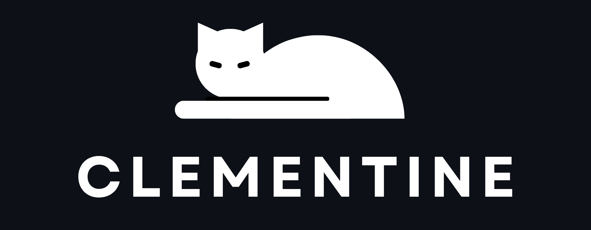
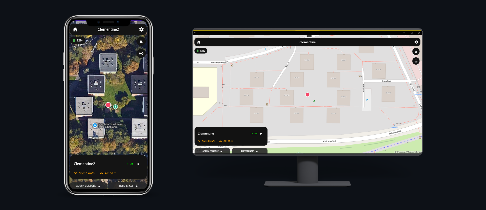
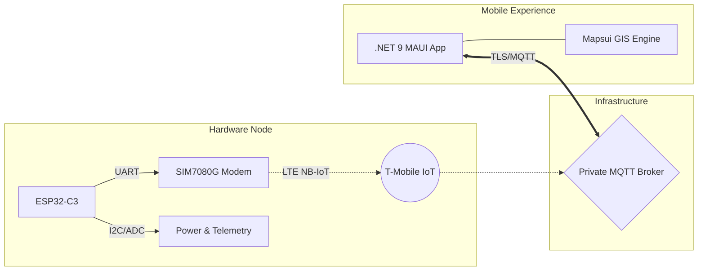
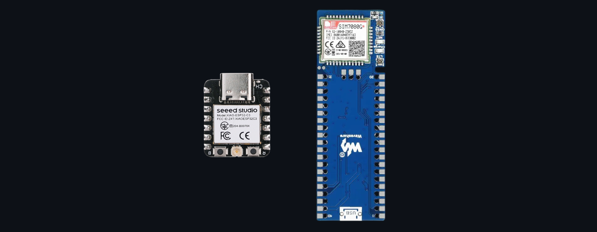
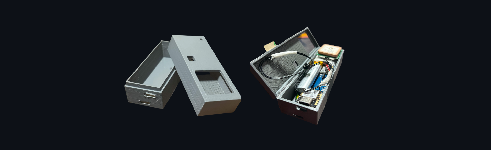
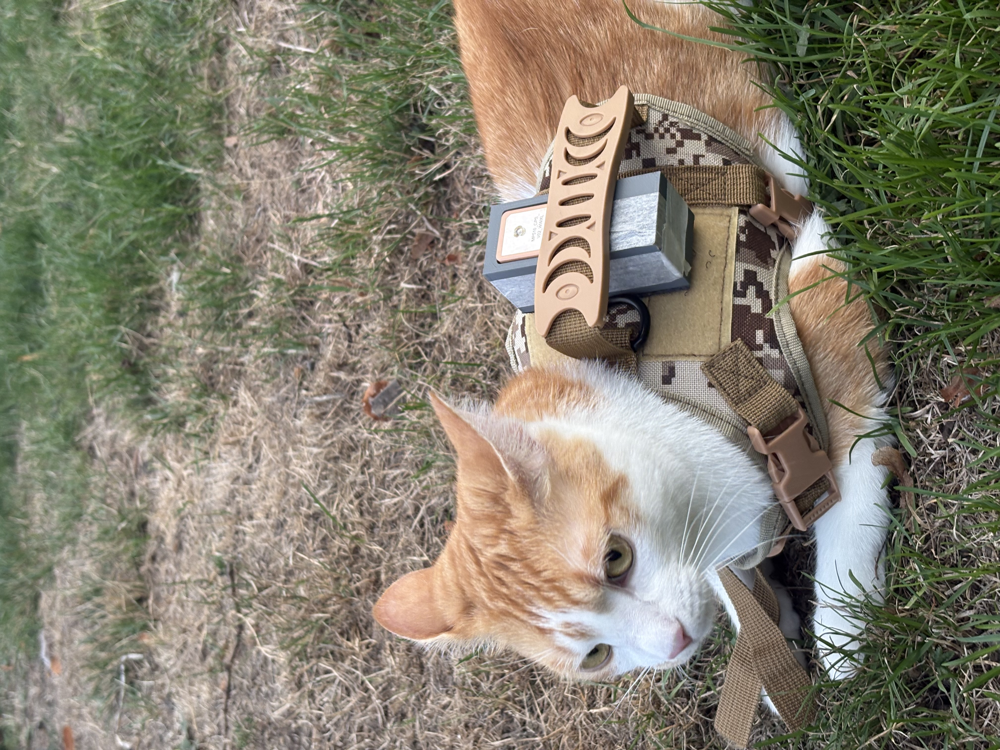

<!-- 
  IMAGE PLACEHOLDERS:
  Replace the paths in the  tags below with your actual images.
  For badges to work fully, replace "USERNAME/REPO" with your actual GitHub path if making public later.
-->

<div align="center">
  
  <h1>Clementine</h1>
  <p><strong>An end-to-end, private cellular tracking ecosystem built for absolute location awareness.</strong></p>
  <p>
    
    
    
    
    
    
  </p>
</div>

> **Clementine is a closed-source ecosystem.** This repository serves as a portfolio showcase. The production source code, infrastructure routing, embedded credentials, and deployment schemas are intentionally strictly private. However, compiled client builds are available in the Releases section. This document details the architectural approach, hardware profile, and UI/UX philosophy from a high-level perspective.

<!-- Hero Image: App UI next to the physical tracker -->
<p align="center">
  
</p>

## The Philosophy

Clementine is not just a tracker; it's a cohesive product ecosystem encompassing custom hardware, embedded C firmware, secure IoT infrastructure, and a fluid cross-platform mobile client. 

The goal was to transform raw, noisy telemetry (AT commands, GNSS fixes, cellular network switching) into a calm, unified, and understandable user experience. The system operates as a reliable black box: the tracker negotiates with the cellular network and satellites, dispatching payloads via MQTT, while the mobile client translates this data into a beautiful, interactive map and dashboard.

## System Capabilities

- **Real-time GIS Tracking:** High-precision GNSS positioning mapped via the open-source **Mapsui** engine, translating spherical Mercator projections into fluid UI updates.
- **Robust Cellular Telemetry:** Powered by an LTE NB-IoT modem, tracking not just location, but speed, altitude, heading, satellite lock, and cellular signal strength (Cell ID/RSRP).
- **Over-the-Air (OTA) Configuration:** Change reporting intervals (e.g., 5s to 60s) or operating modes (GPS, Eco, Diag) directly from the mobile app without waking the device physically.
- **Embedded Admin Console:** A built-in diagnostic terminal within the app for sending raw remote commands to the tracker.
- **Graceful Degradation:** Intelligent UI states that explicitly communicate when data is stale ("Last Known" vs "Live") and smooth pulse animations to confirm real-time synchronization.
- **Deep Personalization:** Multiple custom-designed color themes (Midnight Cyan, AMOLED Black, Forest Pine), SVG iconography, and tracker identity management.

## Architectural Overview



The system strictly decouples data acquisition from presentation. The tracker is a lightweight client pushing JSON payloads, while the `.NET MAUI` application acts as a rich subscriber, parsing the stream and orchestrating the UI on Android and Windows native engines (WinUI3).

## Hardware & Embedded Profile

The physical node is designed for power-efficient, long-term deployment. Before being sealed in its housing, the core relies on highly efficient, miniaturized components.

<!-- Raw Chips Image: ESP32-C3 and SIM7080G side-by-side -->
<p align="center">
  
  <br>
  <em>The core silicon: ESP32-C3 MCU alongside the SIM7080G Cellular/GNSS module.</em>
</p>

| Component | Function |
|---|---|
| **ESP32-C3** | Primary MCU; orchestrates FreeRTOS tasks, power states, and serial bridging. |
| **SIM7080G** | Handles the heavy lifting: CAT-M/NB-IoT network registration and multi-constellation GNSS acquisition. |
| **Connectivity** | T-Mobile IoT SIM paired with specific ceramic GNSS and adhesive LTE antennas for optimized RF performance. |
| **Firmware (C)** | Built on `ESP-IDF`. Manages modem AT-command state machines, graceful reconnects, JSON serialization, and secure MQTT delivery. |
| **Enclosures** | Fully custom 3D-modeled SLA/FDM casings designed for different deployment profiles. |

<!-- Enclosure Image: The printed tracker assembly -->
<p align="center">
  
  <br>
  <em>Custom 3D-modeled casing designed for maximum durability and precise component fit.</em>
</p>

## A Glimpse of the Codebase

While the core source remains private, the snippet below demonstrates the application's approach to robust telemetry parsing. Instead of directly binding raw data, the C# client safely unpackages the JSON payload, validates the `server_time` to prevent temporal anomalies, and smoothly interpolates the map marker's position using easing animations.

```csharp
// Clementine.MainPage.xaml.cs (Excerpt)
service.OnMessageReceived += (topic, payload) =>
{
    MainThread.BeginInvokeOnMainThread(() =>
    {
        try
        {
            using (JsonDocument doc = JsonDocument.Parse(payload))
            {
                var root = doc.RootElement;

                //discard stale or corrupted timestamps
                if (root.TryGetProperty("server_time", out var timeProp) &&
                    DateTime.TryParse(timeProp.GetString(), out DateTime parsedTime) && 
                    parsedTime > DateTime.Now.AddMinutes(-30))
                {
                    _lastMessageTime = parsedTime;
                }
                else return; //ignore invalid chronologies

                //trigger UI pulsing to confirm live connection
                _watchdogTimer.Stop();
                StartPulsing();
                _watchdogTimer.Start();

                //position translation animation
                if (root.TryGetProperty("lat", out var latProp) && root.TryGetProperty("lon", out var lonProp))
                {
                    var sphericalPosition = SphericalMercator.FromLonLat(lonProp.GetDouble(), latProp.GetDouble());
                    MPoint pos = new MPoint(sphericalPosition.x, sphericalPosition.y);

                    UpdateGatoLayer(pos); //refresh custom mapsui layer

                    //fluidly move the camera to the new coordinates
                    mapView.Map.Navigator?.CenterOn(pos, 600, Mapsui.Animations.Easing.CubicInOut);
                }
            }
        }
        catch (Exception ex)
        {
            ShowToast($"Telemetry Parse Error: {ex.Message}");
        }
    });
};
```

## Field Deployment

A system like this proves its worth only in the real world. Below is Klementynka equipped with the tracker module during an active field test, demonstrating the physical form factor and real-world durability of the 3D-printed enclosure.

<!-- Field Usage Image: Klementynka wearing the tracker -->
<p align="center">
  
  <br>
  <em>Active field deployment.</em>
</p>

## Downloads & Releases

While the source code is kept private to protect the underlying infrastructure and embedded secrets, the mobile client is fully built and ready for use. 

Compiled application packages (iterated across multiple versions) are available for free download. You can find the latest Android (APK) and Windows builds in the **[Releases](../../releases)** section of this repository.

## Design & Engineering Principles

- **Quiet Complexity:** The UI hides the complexity of AT commands and MQTT handshakes behind a clean, interactive map.
- **Platform Agnosticism:** Careful XAML architecting ensures the application renders pixel-perfectly on both Android native handlers and the notoriously strict Windows WinUI3 XAML parser.
- **Graceful Uncertainty:** The system never lies. If a signal is lost, the UI explicitly transitions from a green `LIVE` pulse to a gray `LAST KNOWN` state with an elapsed time counter.
- **Hardware-Software Synergy:** The software themes and 3D enclosure variants are designed as a unified product family.

<div align="center">
  <br>
  <sub>Architected, engineered, and designed entirely as a solo venture.</sub>
  <br>
  <sub>Private project · Clementine · 2026</sub>
</div>
